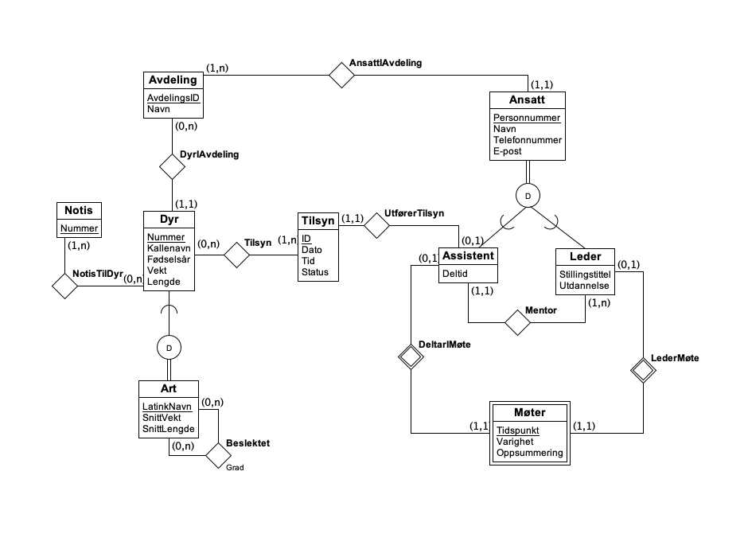
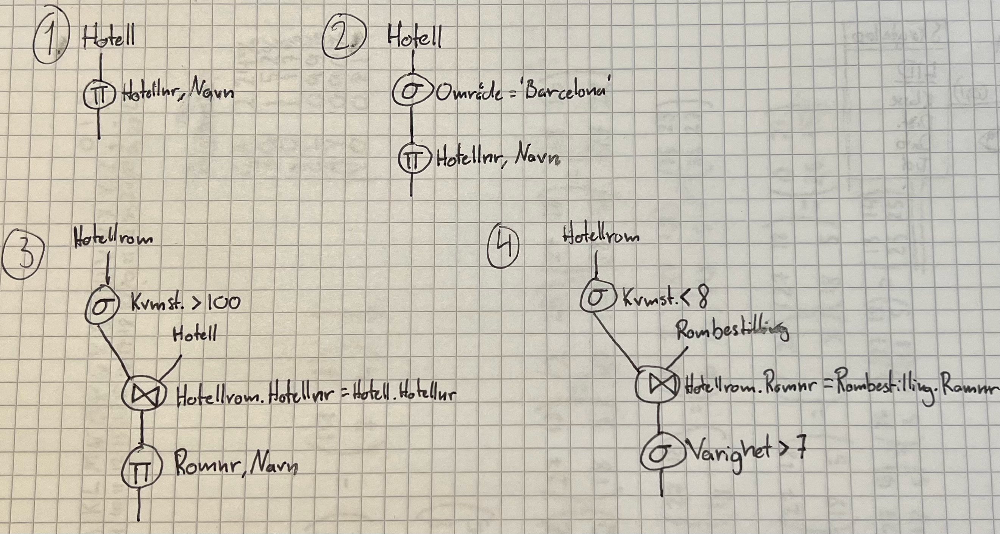
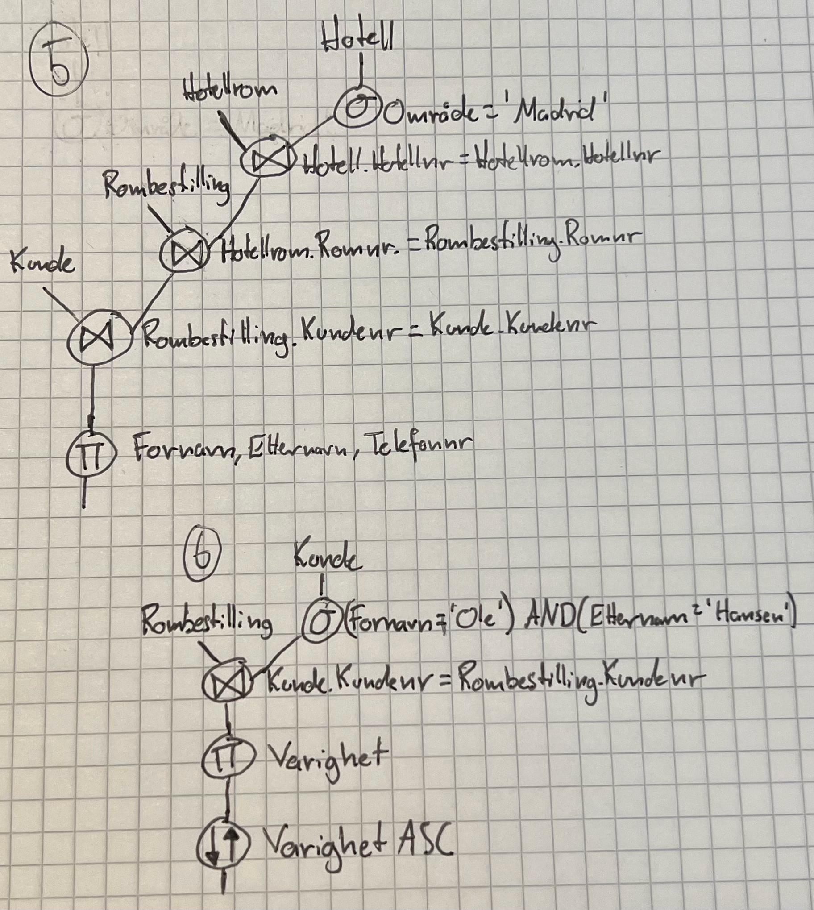

# Øving 2 - Datamodellering og databasesystemer

## Oppgave 1

\begin{itemize}
\item[(a)]
\textit{{Total spesialisering}}: Alle entiteter i superklassen må være med i minst en av subklassene.

\textit{{Disjukte subklasser}}: En entitet i superklassen kan ikke delta i mer enn en subklasse.
Entiteten i subklassen er samme entiet som i superklassen, men i subklassen har den en spesifikk rolle.
En entitet må være medlem av superklassen for å være medlem av subklassen.
For eksempel må man være ansatt for å være medlem i subklassen lærer.  
\end{itemize}

\begin{itemize}
\item[(b)]
\begin{itemize}
\item[(i)] Vi skal stemme med valg, og trenger oversikt over personer som er myndige og ikke-myndige.

\item[(ii)] I en konkurranse er det kun lov å delta i en klasse. Alle personer som tilhører konkurransen skal registerers. Vi har utøvere som stiller i forskjellige klasser, samt diverse personer som jobber eller er frivillig.

\item[(iii)] Ved NTNU er finnes det ansatte og studenter. Noen studenter kan være også være ansatt. Alle som tilhører ved NTNU må registerers.  

\item[(iv)] Oversikt over ansatte ved en bedrift. Ansatte kan ha flere roller, for eksempel lærer, vaktmester, rektor. Men må ikke være delt i en gruppe.
\end{itemize}
\end{itemize}

\begin{itemize}
\item[(c)]
Figur 1: Kan vel ikke ha relasjon mellom superklasse og subklasse.

Figur 4: Mangler superklasse for subklassene.
\end{itemize}

## Oppgave 2

{ width=91\% }

## Oppgave 3

Entitetsintegritet handler om at alle entiteter må kunne identifiseres.
Dette kan gjøres ved å ha en unik nøkkel for hver entitet.
Ingen entiteter kan ha like nøkler, og nøkkelen kan ikke være NULL.
Primærnøkkelen er identifiserende for entiteter i en tabell.

Fremmednøkkelen til en entitet i en tabell i en database refererer til en annen entitets primærnøkkel i en annen tabell i databasen. 
Referanseintegritet handler om at alle referanser er gyldige.
Blant annet må fremmednøkkelen eksistere, altså referansen til en annens primærnøkkel.

## Oppgave 4

\begin{itemize}
\item[(a)]
\textbf{{Eksamen}}(\underline{EksamenNr}, Fagkode, Hjelpemiddelkode)

\textbf{{Student}}(\underline{StudentNr}, Navn)

\textbf{{Eksamenslokale}}(\underline{RomNr}, Navn, Kapasitet)

\textbf{{Bord}}(\underline{BordNr}, Type, Eksamenslokale)  
Eksamenslokale er fremmednøkkel til Eksamenslokale

\textbf{{Stol}}(\underline{StolNr}, Type, Eksamenslokale)  
Eksamenslokale er fremmednøkkel til Eksamenslokale

\textbf{{HarEksamen}}(\underline{EksamenNr, StudentNr})

\textbf{{Oppsatt}}(\underline{EksamenNr, StudentNr}, Dato, StudentPlassering)

\item[(b)]
\end{itemize}

