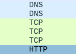
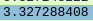

## Spørsmål

1. TCP, HTTP og DNS

2. Det tok $3.34 - 3.33 = 0.01$ sekunder å motta `HTTP OK` svaret.

3. Adressen til `gaia.cs.umass.edu` er `13.33.141.109`, og adressen til min maskin er `192.168.0.173`.

4. Størrelsen til innholdet i `HTTP OK` meldingen var `428 bytes`.

5. Skjermbilder: 

